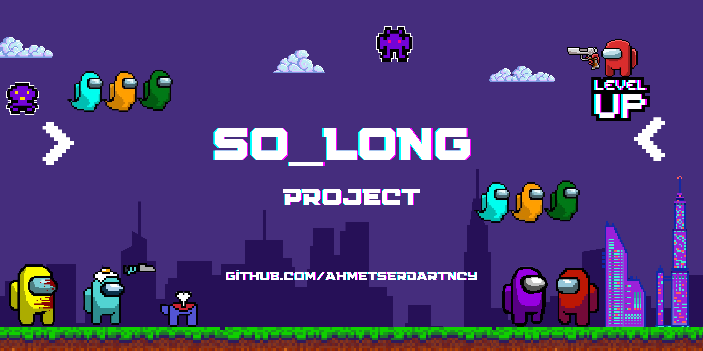
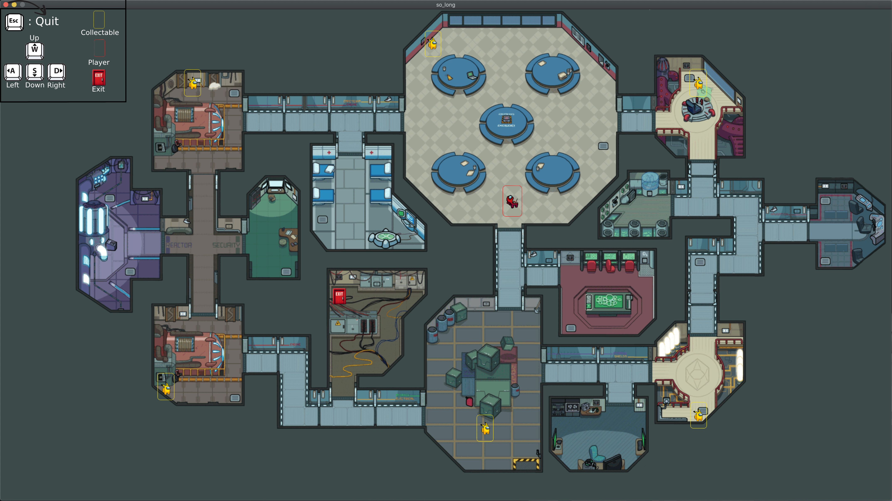

### 42_So_Long



Bu proje, Among Us adlı oyunun esinlenerek C dili kullanılarak geliştirilmiştir. Projede, Mlx görüntü işleme kütüphanesi kullanılmıştır.

---

#### İçindekiler

1. [Proje Hakkında](#proje-hakkında)
2. [Bağımlılıklar](#bağımlılıklar)
3. [Kurulum](#kurulum)
4. [Kullanım](#kullanım)
5. [Ekran Görüntüleri](#ekran-görüntüleri)
6. [Katılımcılar](#katılımcılar)

---

#### Proje Hakkında

Bu proje, Among Us oyunundan esinlenilerek geliştirilen bir C dilidir. Mlx görüntü işleme kütüphanesi kullanılarak geliştirilmiştir.

---

#### Bağımlılıklar

Projenin çalıştırılabilmesi için aşağıdaki bağımlılıkların yüklü olması gerekmektedir:

- [Mlx Görüntü İşleme Kütüphanesi](https://github.com/42Paris/minilibx-linux)

---

#### Kurulum

Proje bağımlılıkları yüklendikten sonra aşağıdaki adımları takip ederek projeyi kurabilirsiniz:

```bash
git clone https://github.com/AhmetSerdarTncy/42_So_Long.git
cd 42_So_Long
make
```

---

#### Kullanım

Proje başarıyla derlendikten sonra aşağıdaki komutları kullanarak programı çalıştırabilirsiniz:

```bash
./so_long maps/map.ber
```

---

#### Ekran Görüntüleri


*Ekran Görüntüsü Açıklaması 2*


*Oynanış Ekranı*

---

#### Katılımcılar

- [Ahmet Serdar TUNÇAY](https://github.com/AhmetSerdarTncy)

---
